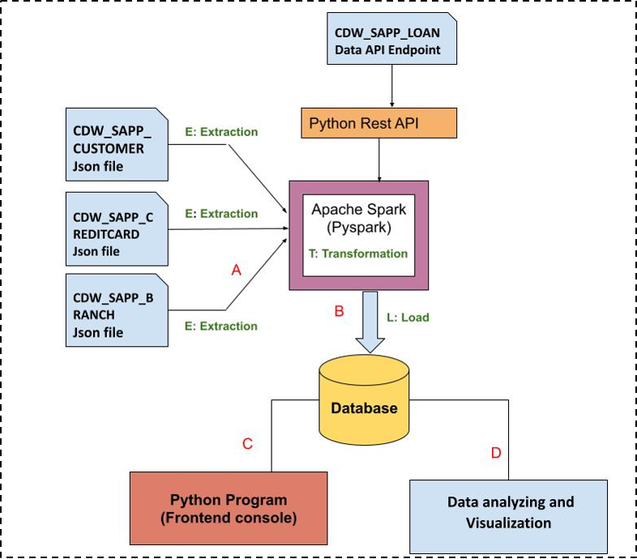

# Capstone

Process:

The Capstone was the final project for my Per Scholas Data Engineering Bootcamp. The picture below shows the workflow of the project. I created a Banking database, a console-based menu where users can retrieve information, and a data analysis/visualization section. I split it into two files: ETL_process.ipynp for the ETL process and data analysis/visualization part and Menu.py for creating the menu where users can retrieve information.

ETL and Data Visualization:

To start the project, I created a MySQL database and loaded branch, customer, and credit data into them which were provided as JSON files. Once I had all the data in the database, I was ready to perform the data analysis section of the project. In the data analysis section, the task was to find and plot valuable information that can be used for Business Analysts. I found how often each transaction type was made and created a pie chart. I also found which states have the most the most customers, the sum of all transactions for each custoemr, and which customer has the highest transaction amount.

Here are some of the visualizations I created:

Menu:

In the next part of the project, I was tasked to create a console-based application where users can retrieve transaction details and customer details through a menu. I created the Menu.py file. When the file is run, users are asked to select one of the following options:

(1) List of Transactions in Zipcode in Month
(2) Total Transactions and Value of Transaction Type
(3) Total Transactions and Value in State
(4) Account Details
(5) Credit Card Bill in Month
(6) Banking Transactions
(7) Modify Account Details
(8) Quit

Depending on what the user inputs in the menu, a function would be called displaying the output.

Challenges:

One of the technical challenges I faced in developing this project was loading the data into the database. I was stuck with "Py4JJavaError: An error occurred while calling o46.save.
: java.sql.SQLException: No suitable driver" error no matte what I did. Even after downloading the mysql connector driver and placing it in the jar folder in pyspark where it can accessed, I was still having this issue. I was finally able to write the data by including ".option("driver", 'com.mysql.jdbc.Driver')" into my coding in writing the data.
